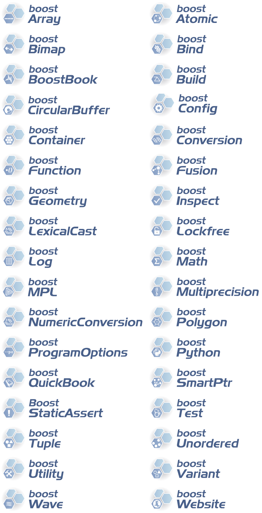

# Boost logos

#### Designs of logos for Boost.org libraries.

Logos for each library are saved as [vector graphics](http://en.wikipedia.org/wiki/Vector_graphics) ([SVG](http://en.wikipedia.org/wiki/Scalable_Vector_Graphics) file) and PNG image for convenience. For many libraries there is some number of alternative versions. Additionally a consistent set of logos can be found in files logos.svg and logos.png (which is also displayed below). Notice that not all versions of logos can be found there.

#### Logos creation and modification

To edit and modify a [vector graphics](http://en.wikipedia.org/wiki/Vector_graphics) you'll need [vector graphics editor](http://en.wikipedia.org/wiki/Vector_graphics_editor).

Logos in this repository was created using [Inkscape](http://en.wikipedia.org/wiki/Inkscape), a multiplatform open source vector graphics editor which can be downloaded [here](http://inkscape.org). To install it on Linux with `apt-get` you can execute `sudo apt-get install inkscape` in terminal. Tutorials can be found in the Net, e.g. [here](http://inkscape.org/en/learn/tutorials/).

To create a new logo edit one of the existing ones (the best would be the one containing elements you'd like to use in your new logo, e.g. some shapes/arrows) and remove unneeded parts.

#### Example set

